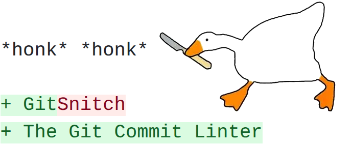

# gitsnitch :dagger::goose:



**gitsnitch** lints your Git commit history against a declarative ruleset — locally as a pre-commit/pre-push hook, or in any CI/CD pipeline.

You define *assertions*: each assertion has a condition that each commit must satisfy (or a condition under which to skip it entirely). Conditions can match against the commit message title, body, or raw text; inspect changed file paths or diff lines; or compare numeric metrics such as diff line count against a threshold. Violations are assigned a numeric severity, mapped to named bands (`Information`, `Warning`, `Error`, `Fatal`), and surfaced with configurable banners and remediation hints.

Think of it as a linter, but for commit hygiene — enforced consistently across every author and every environment.

### Features

* **Message rules** — require conventional-commit titles, ticket references in the body, or any regex pattern against title/body/raw message
* **Diff rules** — restrict changed file paths, detect forbidden line patterns, or gate on diff size (line count thresholds)
* **Context-aware skipping** — skip assertions conditionally, e.g. on maintenance branches
* **Severity bands** — map numeric severity (0–250) to `Information / Warning / Error / Fatal` with configurable thresholds
* **Severity-as-exit optional mode** — when enabled, exit with the maximum violation severity; internal/runtime errors are reserved to 251–255
* **Shallow clone healing** — automatically deepens shallow CI checkouts before linting
* **Remediation hints** — show actionable guidance on violation via Jinja2 banner templates


## Configuration

### Config file autodiscovery

When no `--config` flag is given, gitsnitch searches the git repository root for config files in this precedence order:

1. `.gitsnitch.toml`
2. `.gitsnitchrc` (no extension, parsed as TOML)
3. `.gitsnitch.json`
4. `.gitsnitch.json5`
5. `.gitsnitch.yaml`
6. `.gitsnitch.yml`

The first match wins. If none is found, gitsnitch runs with no config (no assertions).

### Overriding the discovery root

The discovery root defaults to the git repository root (`git rev-parse --show-toplevel`). Override it with an environment variable:

```sh
GITSNITCH_CONFIG_ROOT=/path/to/config/dir gitsnitch
```

The env var prefix defaults to `GITSNITCH_` and can be changed with `--env-prefix`:

```sh
gitsnitch --env-prefix CI_
# now reads CI_CONFIG_ROOT instead of GITSNITCH_CONFIG_ROOT
```

You can also use a project-specific namespace when preferred:

```sh
gitsnitch --env-prefix GITSNITCH_CUSTOM_NAMESPACE_
# reads GITSNITCH_CUSTOM_NAMESPACE_CONFIG_ROOT, GITSNITCH_CUSTOM_NAMESPACE_SOURCE_REF, ...
```

### Explicit config path

Pass an explicit file path to skip autodiscovery entirely:

```sh
gitsnitch --config path/to/config.toml
```

Pass `-` to read the config from stdin:

```sh
cat my-config.toml | gitsnitch --config -
```

### Exit code behavior

`gitsnitch` reserves process exit codes `251..255` for internal/runtime failures.

Violation exit behavior is controlled by `violation_severity_as_exit_code`:

* `false` (default): violations are reported but process exit remains `0`.
* `true`: process exit code is the maximum violating assertion severity (`0..250`).

Examples:

* violations with severities `{100, 200}` and mode `true` => exit `200`
* violations with severities `{0, 0}` and mode `true` => exit `0`
* any violations and mode `false` => exit `0`

CLI override:

```sh
gitsnitch --violation-severity-as-exit-code true ...
```

Precedence:

1. CLI `--violation-severity-as-exit-code`
2. config `violation_severity_as_exit_code`
3. default `false`

## Lint Scope Input Contract

gitsnitch requires an explicit lint scope. Choose exactly one mode:

1. Single commit mode:

```sh
gitsnitch --commit-sha <sha>
```

2. Ref range mode:

```sh
gitsnitch --source-ref <source-ref> --target-ref <target-ref>
```

Rules:

* `--commit-sha` is mutually exclusive with `--source-ref` and `--target-ref`.
* `--source-ref` and `--target-ref` must be provided together.
* If none are provided, gitsnitch fails with an explicit error.

## Environment Variable Remapping

gitsnitch resolves runtime env vars using canonical keys and explicit remapping controls. It does not include built-in CI provider variable names.

With the default prefix (`GITSNITCH_`), the following keys are supported:

* `GITSNITCH_CONFIG_ROOT`
* `GITSNITCH_COMMIT_SHA`
* `GITSNITCH_SOURCE_REF`
* `GITSNITCH_TARGET_REF`

You can change the prefix with `--env-prefix`:

```sh
gitsnitch --env-prefix CI_
```

This changes lookups to:

* `CI_CONFIG_ROOT`
* `CI_COMMIT_SHA`
* `CI_SOURCE_REF`
* `CI_TARGET_REF`

### Direct key remapping

If prefix-only namespacing is not sufficient, you can remap canonical `GITSNITCH_*` keys to arbitrary env var names with repeatable `--remap-env-var` flags:

```sh
gitsnitch \
	--remap-env-var GITSNITCH_SOURCE_REF=PRE_COMMIT_TO_REF \
	--remap-env-var GITSNITCH_TARGET_REF=PRE_COMMIT_FROM_REF
```

Supported remap keys are:

* `GITSNITCH_SOURCE_REF`
* `GITSNITCH_TARGET_REF`
* `GITSNITCH_COMMIT_SHA`
* `GITSNITCH_CONFIG_ROOT`

Rules:

* Format must be `KEY=ENV_VAR`.
* `ENV_VAR` must be non-empty.
* A key can only be remapped once.
* For a remapped key, gitsnitch reads only the remapped env var (no fallback to prefixed key for that key).
* `--remap-env-var` is mutually exclusive with non-default `--env-prefix` values.

Precedence per canonical key:

1. CLI flag (for example, `--source-ref`)
2. `--remap-env-var  KEY=ENV_VAR` lookup
3. `--env-prefix` lookup (`{PREFIX}{KEY}`), only when that key is not remapped

### Example invocations

1. pre-commit/prek pre-push env vars remapped

For pre-push, `SOURCE_REF` maps to the pushed head (`PRE_COMMIT_TO_REF`) and `TARGET_REF` maps to the remote base (`PRE_COMMIT_FROM_REF`).

```sh
gitsnitch \
	--remap-env-var GITSNITCH_SOURCE_REF=PRE_COMMIT_TO_REF \
	--remap-env-var GITSNITCH_TARGET_REF=PRE_COMMIT_FROM_REF
```

2. GitHub Actions with explicit flags (recommended for CI)

```sh
gitsnitch \
	--source-ref "$GITHUB_SHA" \
	--target-ref "origin/${GITHUB_BASE_REF}"
```


## Contributing

```bash
make install-tools
```

### Code-Quality

One-off run prek (1)

```
prek --stage manual --all-files
```

Install pre-commit and pre-push hooks

```
prek install
prek install --hook-type pre-push
```


---

1) [prek quote](https://prek.j178.dev/):
<blockquote>
prek is a reimagined version of pre-commit, built in Rust. It is designed to be a faster, dependency-free and drop-in alternative for it, while also providing some additional long-requested features.
</blockquote>
